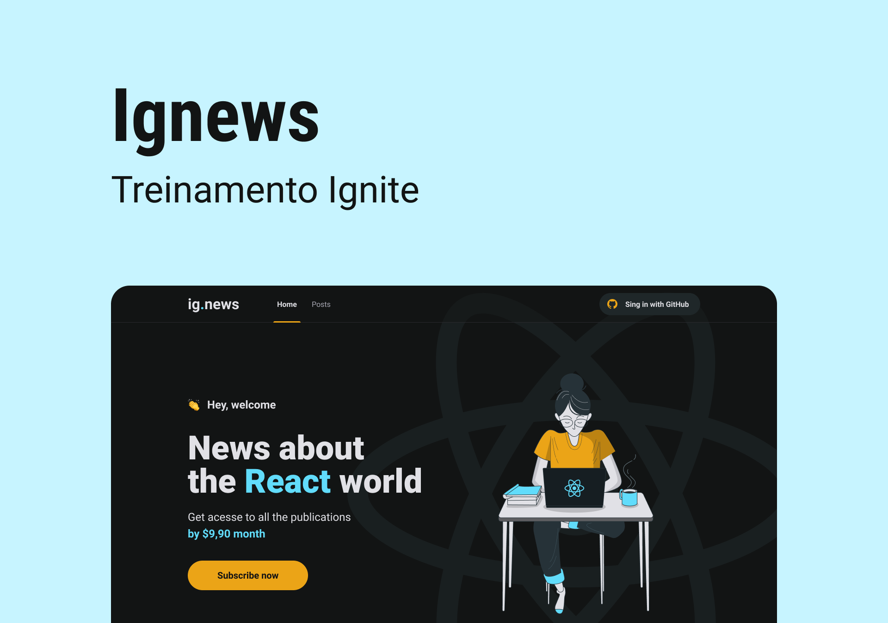

  

  <a href="#-tecnologias">Tecnologias</a>&nbsp;&nbsp;&nbsp;|&nbsp;&nbsp;&nbsp;
  <a href="#-projeto">Projeto</a>&nbsp;&nbsp;&nbsp;|&nbsp;&nbsp;&nbsp;
  <a href="#memo-licença">Licença</a>

## 🚀 Tecnologias

- HTML
- CSS
- JavaScript
- React
- Next
- SASS
- Stripe

## 🚧 Projeto

Live Preview: Em breve

## 🎨 Layout:

Figma: https://www.figma.com/file/HkqlFZv6HJNdoKRXZp8Vvv/ig.news-(Copy)?node-id=3%3A7

## :memo: Licença

Esse projeto está sob a licença MIT. Veja o arquivo [LICENSE](LICENSE) para mais detalhes.

---

Feito com ♥ by joaoD3V